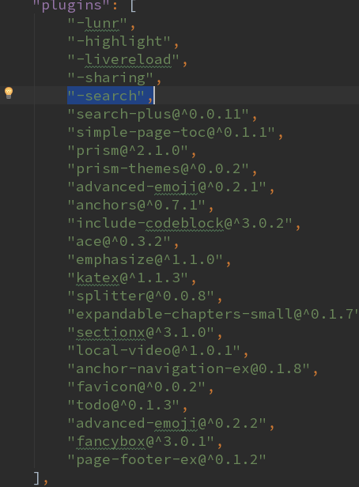
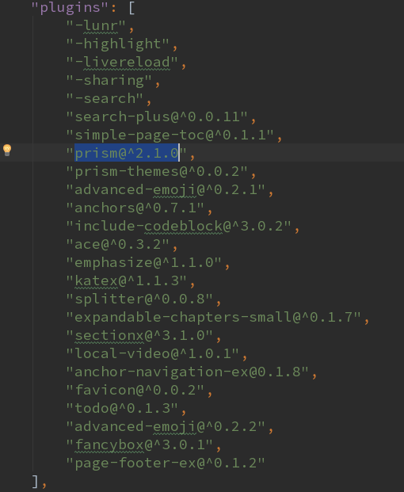
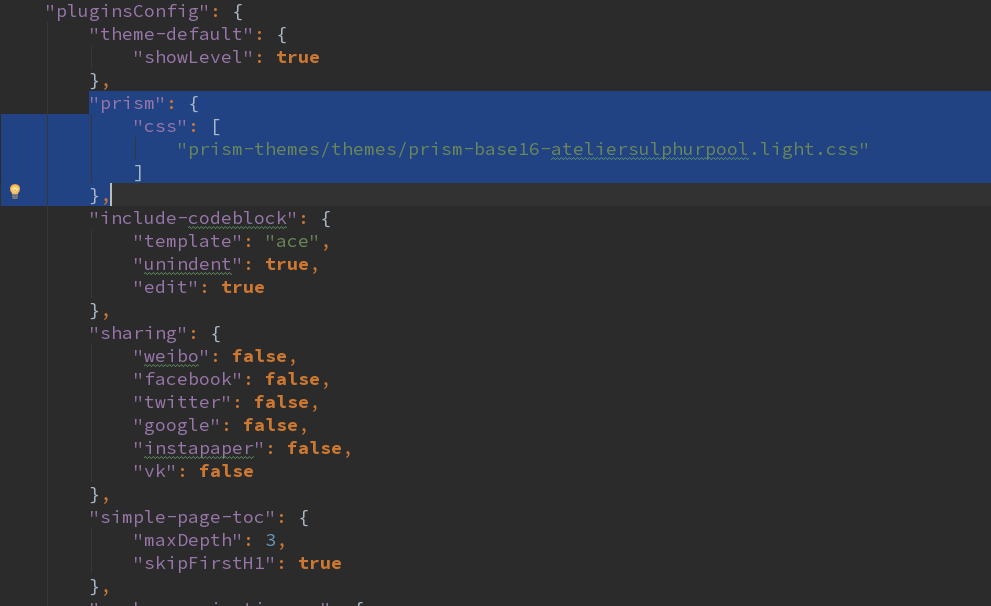

# 插件介绍

## 插件说明

插件的增、减、配置在`book.json`，如果需要对插件进行操作，修改`book.json`文件即可

### Gitbook自带插件：

    * highlight：高亮
    * search：搜索
    * sharing：分享
    * font-settings：字体设置
    * livereload

### 去除自带插件

可以在插件名称前面加-



### 添加插件

添加某个插件后需要在启动或者生成静态页面时候下载插件



### 插件自定义配置

不同的插件有自己特殊的配置，使用者可以自定义，具体的配置参照该插件的文档



## 常用插件

记录一些实用的插件, 如果要指定插件的版本可以使用 plugin@0.3.1。下面的插件在 GitBook 的 3.2.3 版本中可以正常工作，因为一些插件可能不会随着 GitBook 版本的升级而升级，即下面的插件可能不适用高版本的 GitBook，所以这里指定了 GitBook 的版本。
也可以在[插件库](https://plugins.gitbook.com/)中搜索


### 搜索插件1

[search-pro插件](https://plugins.gitbook.com/plugin/search-pro)支持中文搜索, 需要将默认的search插件去掉, 注意: 如果标题中有包含的关键字, 标题的样式会有所变化,

```json
{
    "plugins": [
        "-search",
        "search-pro"
    ],
    "pluginsConfig": {
        "search-pro": {
            "cutWordLib": "nodejieba",
            "defineWord" : ["Gitbook Use"]
        }
    }
 }
```
### 搜索插件2

[search-plus插件](https://plugins.gitbook.com/plugin/search-plus)支持中文搜索, 需要将默认的search插件去掉, 注意: 如果标题中有包含的关键字, 标题的样式会有所变化,在使用时候发现本插件要比上插件好用

```json
{
    "plugins": [
        "-search",
        "search-plus"
    ],
    "pluginsConfig": {
        "search-plus": {
            "cutWordLib": "nodejieba",
            "defineWord" : ["Gitbook Use"]
        }
    }
}
```
### 评论插件

[disqus插件](https://plugins.gitbook.com/plugin/disqus)：评论插件，添加disqus评论

```json
{
    "plugins": [
        "disqus"
    ],
    "pluginsConfig": {
        "disqus": {
            "shortName": "gitbookuse"
        }
    }
}
```

### 尾部插件

[page-footer-ex插件](https://plugins.gitbook.com/plugin/page-footer-ex)：尾部插件，添加版权，更新时间等

```json
{
    "plugins": [
        "page-footer-ex"
    ],
    "pluginsConfig": {
       "page-footer-ex": {
           "copyright": "版权：苗蓉",
           "markdown": false,
           "update_label": "更新时间：",
           "update_format": "YYYY-MM-DD HH:mm:ss"
       }
    }
}
```

### 图片放大插件

[fancybox插件](https://plugins.gitbook.com/plugin/fancybox)：图片放大插件，可以放大生成的数书中的图片

```json
{
    "plugins": [
        "fancybox"
    ],
    "pluginsConfig": {
        "fancybox": {
          //your fancybox config here
        }
    }
}
```


### emoji表情插件

[advanced-emoji插件](https://plugins.gitbook.com/plugin/advanced-emoji)：支持emoji表情

```json
{
    "plugins": [
        "advanced-emoji"
    ]
}
```


### Github

[Github插件](https://plugins.gitbook.com/plugin/github)：添加github图标

```json
{
    "plugins": [
      "github"
     ],
    "pluginsConfig": {
        "github": {
            "url": "https://github.com/your/repo"
        }
    }
}
```
### Ace Plugin

[Ace插件](https://plugins.gitbook.com/plugin/ace)：使gitbook支持ace

```json
{
    "plugins": [
        "ace"
    ]
}
```

### Emphasize

[Emphasize插件](https://plugins.gitbook.com/plugin/emphasize)：为文字加上底色

```json
{
    "plugins": [
        "emphasize"
    ]
}
```

### 支持数学公式

[katex插件](https://plugins.gitbook.com/plugin/katex)：为了支持数学公式, 我们可以使用KaTex和MathJax插件, 官网上说Katex速度要快于MathJax

```json
    {
        "plugins": [
            "katex"
        ]
    }
```

> **[info] 使用示例**

```
    $$
    \int_{-\infty}^\infty g(x) dx
    $$
```
效果如下：

$$
\int_{-\infty}^\infty g(x) dx
$$


### 支持代码块插件

[include-codeblock插件](https://plugins.gitbook.com/plugin/include-codeblock)：使用代码块的格式显示所包含文件的内容. 该文件必须存在。插件提供了一些配置，可以区插件官网查看。如果同时使用 ace 和本插件，本插件要在 ace 插件前面加载

```json
    {
        "plugins": [
            "include-codeblock"
        ],
        "pluginsConfig": {
            "include-codeblock": {
                "template": "ace",
                "unindent": "true",
                "theme": "monokai"
            }
        }
    }
```

> **[info] 使用示例**

```
[include](other/test.js)
    or
[import](other/test.js)
```

效果如下：


[include](other/test.js)


### 侧边栏插件

[splitter插件](https://plugins.gitbook.com/plugin/splitter)：使侧边栏的宽度可以自由调节

```json
{
    "plugins": [
        "splitter"
    ]
}
```


### Mermaid图表插件

[mermaid-gb3插件](https://plugins.gitbook.com/plugin/mermaid-gb3)：支持渲染Mermaid图表

```json
{
    "plugins": [
        "mermaid-gb3"
    ]
}
```

> **[info] 使用示例**


`````
    ```mermaid
    graph TD;
      A-->B;
      A-->C;
      B-->D;
      C-->D;
    ```
`````

效果如下：


### Puml

[puml插件](https://plugins.gitbook.com/plugin/puml)：使用 PlantUML 展示 uml 图,[PlantUML 地址](http://plantuml.com/)

```json
{
    "plugins": [
        "puml"
    ]
}
```

> **[info] 使用示例**


```
    
    Bob->Alice : hello
    
```

效果如下：


Bob->Alice : hello



### Graph

[graph插件](https://plugins.gitbook.com/plugin/graph)：使用 [function-plot](https://mauriciopoppe.github.io/function-plot) 绘制数学函数图。


> **[info] 使用示例**

```json


{
    "title": "1/x * cos(1/x)",
    "grid": true,
    "xAxis": {
        "domain": [0.01, 1]
    },
    "yAxis": {
        "domain": [-100, 100]
    },
    "data": [{
        "fn": "1/x * cos(1/x)",
        "closed": true
    }]
}


```

效果如下：


{
    "title": "1/x * cos(1/x)",
    "grid": true,
    "xAxis": {
        "domain": [0.01, 1]
    },
    "yAxis": {
        "domain": [-100, 100]
    },
    "data": [{
        "fn": "1/x * cos(1/x)",
        "closed": true
    }]
}


### Chart

[chart插件](https://plugins.gitbook.com/plugin/chart):使用 [C3.js](https://github.com/c3js/c3) 或者 [Highcharts](https://github.com/highcharts/highcharts) 绘制图形。

```json

{
    "plugins": [
        "chart"
    ],
    "pluginsConfig": {
        "chart": {
            "type": "highcharts"
        }
    },
}

```

> **[info] 使用示例**

```

{
    "chart": {
        "type": "bar"
    },
    "title": {
        "text": "Fruit Consumption"
    },
    "xAxis": {
        "categories": ["Apples", "Bananas", "Oranges"]
    },
    "yAxis": {
        "title": {
            "text": "Fruit eaten"
        }
    },
    "series": [{
        "name": "Jane",
        "data": [1, 0, 4]
    }, {
        "name": "John",
        "data": [5, 7, 3]
    }]
}

```

效果如下：


{
    "chart": {
        "type": "bar"
    },
    "title": {
        "text": "Fruit Consumption"
    },
    "xAxis": {
        "categories": ["Apples", "Bananas", "Oranges"]
    },
    "yAxis": {
        "title": {
            "text": "Fruit eaten"
        }
    },
    "series": [{
        "name": "Jane",
        "data": [1, 0, 4]
    }, {
        "name": "John",
        "data": [5, 7, 3]
    }]
}



### ga

[ga插件](https://plugins.gitbook.com/plugin/ga):Google 统计

```json
{
    "plugins": [
        "ga"
     ],
    "pluginsConfig": {
        "ga": {
            "token": "UA-XXXX-Y"
        }
    }
}
```
### 3-ba

[3-ba插件](https://plugins.gitbook.com/plugin/3-ba):百度统计

```json
{
    "plugins": ["3-ba"],
    "pluginsConfig": {
        "3-ba": {
            "token": "xxxxxxxx"
        }
    }
}

```


### Alerts

[alerts插件](https://plugins.gitbook.com/plugin/alerts):添加不同 alerts 样式的 blockquotes，目前包含 info, warning, danger 和 success 四种样式。

```json
{
    "plugins": ["alerts"]
}

```
> **[info] 使用示例**

```
    Info styling
    > **[info] For info**
    >
    > Use this for infomation messages.

    Warning styling
    > **[warning] For warning**
    >
    > Use this for warning messages.

    Danger styling
    > **[danger] For danger**
    >
    > Use this for danger messages.

    Success styling
    > **[success] For info**
    >
    > Use this for success messages.
```

效果如下：

Info styling
> **[info] For info**
>
> Use this for infomation messages.

Warning styling
> **[warning] For warning**
>
> Use this for warning messages.

Danger styling
> **[danger] For danger**
>
> Use this for danger messages.

Success styling
> **[success] For info**
>
> Use this for success messages.

### Include-csv

[Include-csv插件](https://plugins.gitbook.com/plugin/include-csv):展示 csv 文件。

```json
{
    "plugins": ["include-csv"]
}
```

> **[info] 使用示例1**

```

hoge,fuga
a,0001
b,002

```

效果如下：


hoge,fuga
a,0001
b,002


> **[info] 使用示例2**

```

```
效果如下：




